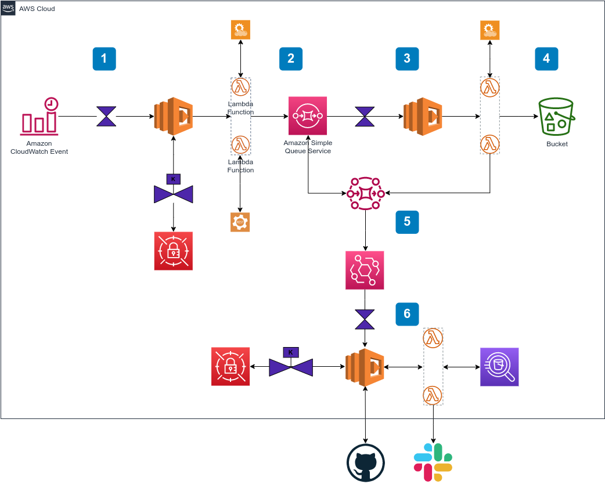

# Data-Engineering

Serverless Architecture on AWS cloud platform for storing and analyzing data

### What You Will Need:
-------------------------------------------------------------------------------
#### for using the External REST JSON API's:
        1. create OAuth access tokens
        2. API access root endpoints URLs
        3. investigate APIs Docs Schema for selecting the required:
           - fields, parameters, rate limits, pagination, response statuses, filters
           to compose a correct request to API

#### need a GitHub account:
        1. git owner, repository, branch
        2. create a personal access token
        3. create GitHub Actions (CI/CD) and use Actions secrets

#### need an AWS account:
        1. an AWS Identity and Access Management (IAM) user with permission to use Amazon SQS, Lambda, and AWS Key Management Service (AWS KMS), AWS Secrets Manager, AWS Glue and Athena and Amazon S3, Amazon EventBridge
        2. create an AWS KMS keys to encrypt each message body using Amazon server-side: Amazon SQS, AWS Secrets Manager, AWS Glue and S3 and Amazon EventBridge
        3. create the secrets in AWS Secrets Manager to store external REST API access tokens(keys) and GitHub personal access token
        4. create SQS queue task messages, and also create a dead-letter queue to ensure that don't lose any task that might be corrupted or fail
            - a SQS-based producer-consumer service running on AWS Lambda using the Serverless Framework and the Lift plugin. It allows to accept messages, for which computation might be time or resource intensive, and offload their processing to an asynchronous background process for a faster and more resilient system

        5. create buckets are containers for data stored in S3 (raw-data, Athena data storage)
        6. create Athena database

#### development:
        1. python3.9
        2. npm
        3. serverless framework (deploy)
        4. git
        5. awscli
        6. create "~.aws/credentials" with ("aws_access_key_id" and "aws_secret_access_key")
        7. Makefile


_Note: see serverless.yml package.json configs-dev-etl.yml Makefile and other_


## ETL Process

-------------------------------------------------------------------------------

### Queue:

* the queue construct deploys a properly configured SQS queue with a worker running on AWS Lambda
  and the following resources:
    - an SQS queue: this is where messages to process should be sent
    - a worker Lambda function: this function processes every message sent to the queue
    - an SQS "dead letter queue": this queue stores all the messages that failed to be processed
    - a CloudWatch alarm that sends an email when the dead letter queue contains failed messages


### Download Data process:

* running once in a day, starting at 01:00
    - use: create crone expressions and attach a schedule event for the "start-download-data" lambda function, this will trigger the function at certain times

* define two  producer functions "producer_vehicles_data" and "producer_sensor_data"
  and one "dawnloader" (Consumer)  in Lift construct - "tasks-queue"
    - the producer's functions compose JSON payloads and send them to an SQS queue for asynchronous processing
    - the SQS queue is created by the jobs queue construct of the Lift plugin
    - the queue is set up with a "dead-letter queue" (to receive failed messages) and a worker Lambda function that processes the SQS messages


* "start-download-data" lambda invoke "producer_vehicles_data" and "producer_sensor_data"

* start running lambda functions "producer_vehicles_data" and "producer_sensor_data"

* each function ("producer_vehicles_data" and "producer_sensor_data")
    - get secret of API OAuth access token
    - send first request to API to get total number pages exist and will to load:
```
          for example API request contains parameters:
                        filters:
                            fromCreationDate: date-time(now - 1day)
                            toCreationDate: date-time(now)
                            timeZone: UTC
                        pageSize: 50000 -- max
          API response: "total_pages" - total number pages
```

    - in loop for each page number in (1 to total_pages):
        send message to sqs "tasks-queue" queue
        the message body contains a string in json format: 

```
            {
            "body": {
                "url_src": "url_src - compose page request to API for download data",
                "url_dest": "url_dest - compose path where to save downloaded data"
                }
            }

```

* lambda function "dawnloader" (Consumer) triggered by queue event
    - use: Create a lambda function "dawnloader" that processes each message to download and save data to s3 storage. You will configure the function to use the source "tasks-queue" queue as the event source.
* lambda function "dawnloader" receive message queue
* get url_src and send request to API for download jsons data
* get url_dest and save the data to s3 storage file:
```
        data = "\n".join(json.dumps({row_data}))
```

**Answer to question 2**

 
* if succeeded:
    - send to queue delete the received message from the queue
    - to check if queue is empty: get number of messages queue
    if queue is empty:
        - send an event to invoke the "queries_executor" lambda function that processes data in Athena


-------------------------------------------------------------------------------
### Data Processing process:

* start running "queries_executor" lambda function
    - get the secret of GitHub API OAuth access token
    - send a request to GitHub API to get the "URL's_list" of SQL files
    - call and invoke the "call_next_task" lambda function with "URL's_list" into event body

* start running "call_next_task" lambda function
    - get url from the "url's_list":

                url = "url's_list".pop()

    - download the content of sql file (sql queries) request to GitHub API
    - prepare and execute each query from this sql file
    - check if "url's_list" is empty:
```
       if empty:
               send MSG: "ETL Done"
          else:
               call and invoke the "call_next_task" lambda function with "URL's_list" into event body

```




## Queries in Athena

-------------------------------------------------------------------------------
### initial setup queries:
```
    CREATE EXTERNAL TABLE IF NOT EXISTS {ATHENA_DB}.{RAW_VEHICLES_DATA} (
            vehicle_id string,
            vehicle_name string,
            vehicle_type string
    )
    ROW FORMAT SERDE 'org.openx.data.jsonserde.JsonSerDe'
    LOCATION 's3://{S3_RAW_BUCKET}/{RAW_VEHICLES_DATA}/'
    ;
```

```
    CREATE EXTERNAL TABLE IF NOT EXISTS {ATHENA_DB}.{RAW_SENSOR_DATA} (
            vehicle_id string,
            timestamp bigint,
            sensor_value double
    )
    ROW FORMAT SERDE 'org.openx.data.jsonserde.JsonSerDe'
    LOCATION 's3://{S3_RAW_BUCKET}/{RAW_SENSOR_DATA}/'
    ;
```


-------------------------------------------------------------------------------

### daily processing queries:

saved in folder ~/Data-Engineering/data_analytics_serverless/queries/ like SQL files


-------------------------------------------------------------------------------
### anatomy of tables:

* VEHICLES_DATA table defined with:
```
        - partitioned_by=ARRAY['VEHICLE_TYPE']
        - format='PARQUET'
        - write_compression='SNAPPY'
```

* SENSOR_DATA table defined with:
```
        - partitioned_by=ARRAY['days', 'VEHICLE_TYPE'],
        - format='PARQUET',
        - write_compression='SNAPPY'
```

_days=CAST(date(from_unixtime(timestamp/1000)) AS date)_

* in addition merged fields of both tables:
```
        VEHICLE_ID, TIMESTAMP, sensor value, days, VEHICLE TYPE
```


**Answer to Question 3**

## Query: 
-------------------------------------------------------------------------------


```
    WITH
difference AS(
    SELECT
        vehicle_id,
        vehicle_type,
        LEAD(timestamp/1000) OVER(PARTITION BY days, vehicle_id, vehicle_type ORDER BY timestamp) - timestamp/1000 AS seconds_to_next_measurement
    FROM sensor_data
    WHERE sensor_value IS NOT NULL
),
avg_difference AS(
    SELECT
        vehicle_id,
        vehicle_type,
        avg(seconds_to_next_measurement) AS avg_difference_time_btween_measurements
    FROM difference
    
    GROUP BY  vehicle_id, vehicle_type
)

SELECT
    vehicle_type,
    avg(avg_difference_time_btween_measurements) AS average_time
FROM avg_difference
GROUP BY  vehicle_type
ORDER BY 1

```


